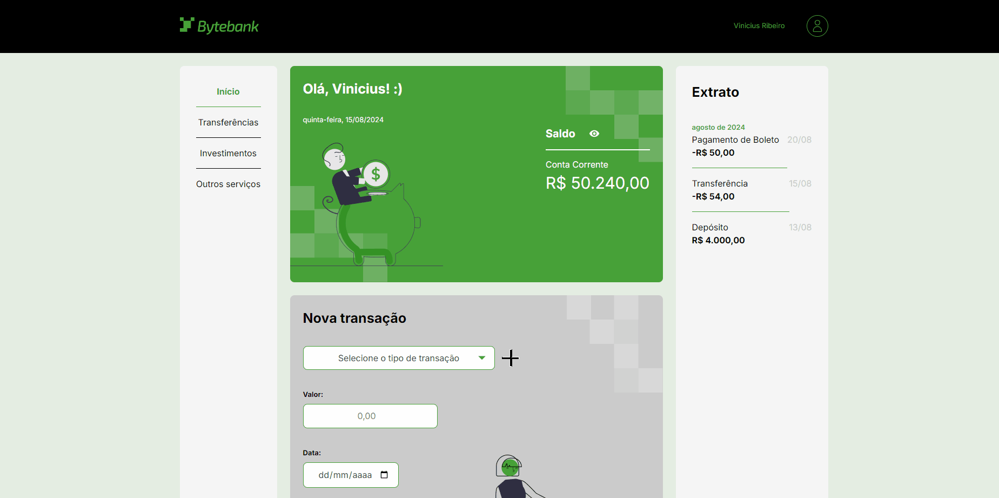

# ByteBank 🏧

Banco digital, onde você terá o histórico de todas as transições, controle seu dinheiro na palma da sua mão.

#### Fique a vontade para navegar, em caso de dúvidas estou disponível 24/7 para você 🫵

    

#### Link para o Site 🎯

    

#### ⬇️Pode me chamar no⬇️

 
    
    
    
     
    <h2>vinii.viniciusribeiro@gmail.com</h2>

#### Tecnologias utilizadas neste projeto 🤖

#### Conhecimentos Adquiridos durante o processo 🤓

- Configuração do ambiente para criar um projeto simples com TypeScript;

- Instalação das ferramentas necessárias;

- Desenvolvimento de uma solução utilizando JavaScript e compreensão de suas limitações;

- Refatoração do código da solução para TypeScript e compreensão inicial de suas vantagen;

- Conhecemos o arquivo tsconfig.json e sua função em um projeto;

- Aprendemos as vantagens de trabalhar com tipos definidos;

- Exploramos a criação de tipos personalizados usando Type Alias e também a criação de Arraystipados no TypeScript;

- Aprendemos o conceito e a aplicabilidade das Enums;

- Reorganizamos a estrutura de arquivos do projeto;

- Aplicamos os conceitos apresentados e explorados na aula 2;

- Realizamos a formatação de moedas e data nos formatos necessários;

- Analisamos os problemas que ainda persistem na aplicação e que podem ser resolvidos por meio dos módulos;

- Compreendemos as vantagens da utilização de módulos na criação de aplicações com TypeScript;

- Reestruturamos o projeto, redefinindo os papéis e responsabilidades de cada componente ou módulo da aplicação;

- Utilizamos os comandos import/export para importar recursos de outros módulos e disponibilizá-los para uso;

- Realizamos o armazenamento das informações da aplicação utilizando o localStorage;

- Agrupamos as transações por data e as exibimos por meio do componente de Extrato;

- Modificamos o objeto Date das Transações para exibir corretamente a data no front-end;

- Construímos toda a lógica do componente de Extrato com base no padrão utilizado pelos demais componentes.
